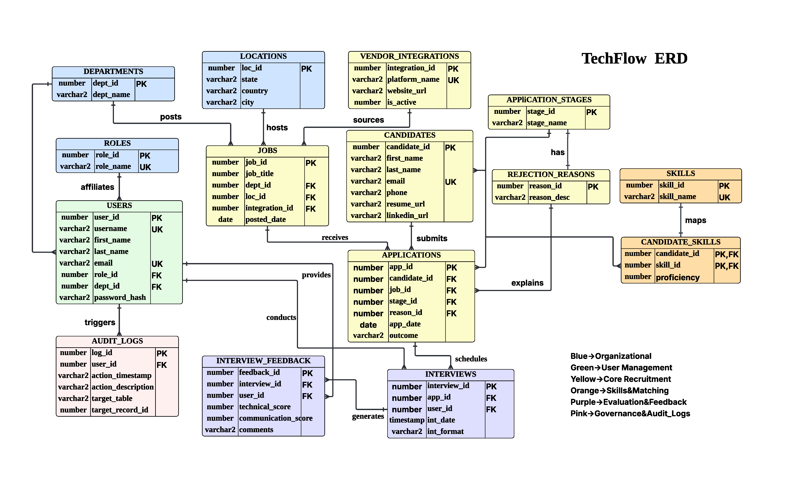

# TechFlow — Centralized Internship Recruitment Management System 🎯

> A production-ready Oracle RDBMS and full-stack application that replaces fragmented spreadsheets with a centralized "Single Source of Truth" for high-volume tech recruitment.

> 📌 **About this repository:** This is a public showcase of design artifacts, architecture documentation, and project highlights. Full source code (Oracle DDL/DML, Node.js backend, React frontend) is available upon request — please contact me directly.

---

## 🎯 Project Overview

TechFlow is a specialized Relational Database Management System engineered to solve the operational bottlenecks of **high-volume internship recruitment** in the technology sector. By replacing fragmented, error-prone spreadsheets with a centralized Oracle-based architecture, the system provides a unified pipeline for candidate tracking, interview scheduling, and standardized technical evaluations.

**Projected business impact:** ~40% reduction in administrative overhead, faster hiring cycles, and improved quality of hire through data-driven decision-making.

---

## 👤 My Role

**Project Lead & Database Architect** (Team of 3)

Responsible for Sections 4, 5, and 6 of the project deliverable:

- 🏗️ **Designed the complete 15-entity Entity-Relationship Diagram** with Crow's-Foot notation across 6 functional modules
- 📐 **Authored normalization analysis** ensuring 3NF compliance and resolving v1.0 schema inconsistencies
- 🔐 **Architected the RBAC security model** with 4 distinct roles and permission matrix
- 📜 **Designed all data dictionary specifications** — 15 tables, constraints, data types optimized for Oracle 19c
- 🗂️ **Structured the 6-module organization** (Organizational, User Management, Core Recruitment, Skills & Matching, Evaluation & Feedback, Governance & Audit)
- 👥 **Led team coordination** and cross-deliverable design reviews

---

## 🏗️ System Architecture

| Layer | Technology | Role |
|-------|-----------|------|
| **Frontend** | React + TypeScript + Vite + Tailwind CSS | 5 page components, hook-based state |
| **Backend** | Node.js + Express (port 3001) | 20+ REST endpoints, connection pooling |
| **Database** | Oracle 19c/21c/23c (thin-mode driver) | 15 tables, 12 indexes, 5 views, 3 triggers |
| **Security** | RBAC + bind variable parameterization | SQL injection prevention at driver level |

---

## 🗄️ Database Design

*Figure: TechFlow Entity-Relationship Diagram — 15 Entities, 16 Relationships, Crow's-Foot Notation*

### 6 Functional Modules

| # | Module | Entities | Purpose |
|---|--------|----------|---------|
| 1 | **Organizational** | Departments, Locations, Roles | Foundation tables with no FK dependencies |
| 2 | **User Management** | Users (consolidated) | Single table with role-based differentiation |
| 3 | **Core Recruitment** | Candidates, Vendor_Integrations, Jobs, Application_Stages, Rejection_Reasons, Applications | Primary data flow from sourcing to outcome |
| 4 | **Skills & Matching** | Skills, Candidate_Skills (M:N bridge) | Proficiency-scored skill matching (1–5) |
| 5 | **Evaluation & Feedback** | Interviews, Interview_Feedback | Panel interview support with separate scoring |
| 6 | **Governance & Audit** | Audit_Logs | Granular record-level activity tracking |

---

## 💡 Key Design Decisions

### Decision 1 — User Table Consolidation
**Problem:** v1.0 schema had separate `Recruiters`, `Hiring_Managers`, and `Users` tables, causing redundant joins and inconsistent role checks.

**Solution:** Merged into a single `Users` table with `role_id FK → Roles` for differentiation. Department affiliation is optional (nullable `dept_id`) for cross-departmental roles like Admin.

**Trade-off:** Slightly more complex application-level role checks vs. dramatically simpler joins across the entire schema.

### Decision 2 — Centralized Rejection Tracking
**Problem:** Manual recruitment systems rarely document *why* candidates are rejected, preventing audit and bias analysis.

**Solution:** Added `Rejection_Reasons` entity with nullable FK from `Applications`. Only rejected applications link to a structured reason; non-rejected applications have NULL `reason_id`.

**Impact:** Enables funnel analysis and bias auditing — directly addresses a documented gap in industry recruitment systems.

### Decision 3 — Panel Interview Support
**Problem:** Standard interview schema assumes the interviewer and evaluator are the same person — fails for panel interviews or post-recording reviews.

**Solution:** `user_id` exists on **both** `Interviews` (assigned interviewer) and `Interview_Feedback` (feedback author). Supports scenarios where a hiring manager reviews a recording or multiple panelists score the same session.

### Decision 4 — Vendor Soft Deletion
**Problem:** Hard-deleting a deprecated job board (e.g., a platform shuts down) would orphan historical job postings.

**Solution:** `Vendor_Integrations.is_active` flag (CHECK IN (0,1)) enables soft deletion. Application UI filters dropdowns to active vendors only, while historical FK references remain intact.

### Decision 5 — Application-Level Cascade Delete
**Problem:** `ON DELETE CASCADE` at the database level is dangerous in production — a single delete can wipe entire pipelines silently.

**Solution:** Removed all `ON DELETE CASCADE` from DDL. The Express API handles cascades within a single transaction, showing user confirmation with the count of affected records before executing.

---

## 🔐 Role-Based Access Control (RBAC)

| Action | Admin | Recruiter | Hiring Manager | Candidate |
|--------|:-----:|:---------:|:--------------:|:---------:|
| Manage Users | ✓ | | | |
| Create Jobs | ✓ | ✓ | | |
| View All Applications | ✓ | ✓ | | |
| Submit Feedback | | | ✓ | |
| View Own Status | | | | ✓ |

Sensitive Personal Information (SPI) protection is enforced through:
- Database-level encryption for email, phone, and password_hash fields
- `Audit_Logs` capture every access or modification to sensitive data
- Candidate data isolated from internal `Users` table for privacy boundary

---

## ⚡ Advanced SQL Implementation

Selected examples demonstrated in the project (full code available on request):

| SQL Feature | Use Case | Schema Aspect Validated |
|-------------|----------|------------------------|
| **Window Functions** (`ROW_NUMBER() OVER PARTITION BY`) | Rank candidates within each job by combined score | 5-table JOIN integrity |
| **MERGE Statement** | Upsert candidate skills from bulk imports | M:N bridge table without duplicate violations |
| **TCL** (SAVEPOINT, ROLLBACK TO, COMMIT) | Recover from accidental rejection while preserving valid stage update | Transaction atomicity |
| **Correlated Subqueries** | Find candidates with multiple applications | Bidirectional candidate-application relationship |
| **Self-Join** | Identify pairs of candidates competing for the same role | Application uniqueness modeling |
| **Analytic Aggregates** | Rejection reason distribution with percentages | Nullable FK funnel analysis |

---

## 🗃️ Database Objects Summary

| Object Type | Count | Purpose |
|-------------|:-----:|---------|
| Tables | 15 | 3NF-normalized entities across 6 modules |
| Indexes | 12 | Optimized on FK columns and frequent WHERE/ORDER BY targets |
| Views | 5 | Pre-built reporting (funnel, candidate scores, rejections, skills, jobs) |
| Synonyms | 5 | Ad-hoc reporting shortcuts (`SELECT * FROM funnel`) |
| Triggers | 3 | Automated audit logging + feedback validation |
| Stored Procedures/Functions | 4 | `sp_advance_stage`, `sp_reject_application`, `fn_candidate_score`, `fn_stage_count` |
| Sequences | 1 explicit + 14 identity-based | Audit log numbering + auto-generated PKs |

---

## 🛠️ Technology Stack

**Database**
- Oracle Database 19c/21c/23c
- `oracledb` Node.js driver (v6, thin mode — no Instant Client required)
- Connection pooling via `oracledb.createPool()`

**Backend**
- Node.js + Express (port 3001)
- 20+ REST endpoints organized into 3 categories (CRUD, lookups, analytics)
- Bind variable parameterization (`:name` syntax) for SQL injection prevention
- `lowerKeys()` helper for Oracle uppercase → frontend lowercase field mapping

**Frontend**
- React + TypeScript
- Vite (build tool with HMR + dev proxy to backend)
- Tailwind CSS
- Hook-based state management (`useState`, `useCallback`, `useEffect`)
- 5 pages: Candidates, Jobs, Applications, Feedback, System Architecture

---

## 📊 Project Metrics

| Metric | Value |
|--------|------:|
| Entities (normalized to 3NF) | 15 |
| Functional modules | 6 |
| Relationships | 16 |
| Database indexes | 12 |
| REST API endpoints | 20+ |
| Sample candidates (seed data) | 18 |
| Sample applications (seed data) | 28 |
| Team size | 3 |
| Final grade | A |

---

## 🤝 Source Code Access

The full source code is available upon request:

- **Oracle DDL** — 15 tables, dependency-ordered, all constraints named
- **Oracle DML** — 28 applications, 18 candidates, 14 interviews with feedback
- **Other Objects** — Views, triggers, procedures, synonyms
- **Backend** — Node.js + Express + oracledb
- **Frontend** — React + TypeScript + Vite + Tailwind

📧 **Contact:** wu.re@northeastern.edu  
💼 **LinkedIn:** [linkedin.com/in/renna-wu](https://linkedin.com/in/renna-wu)

---

## 👥 Team

This was a 3-person team project for DAMG 6210 (Spring 2026). This repository showcases my individual contributions: the ERD design, schema architecture, normalization analysis, RBAC framework, and security design (Sections 4, 5, 6, and ERD).

---

## 📋 Context

**Course:** DAMG 6210 — Data Management and Database Design  
**Institution:** Northeastern University, College of Engineering  
**Term:** Spring 2026  
**Version:** 3.0 (Production Ready)

---

This repository contains design artifacts and architecture documentation. Full source code is available upon request to respect team collaboration boundaries.
